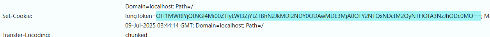
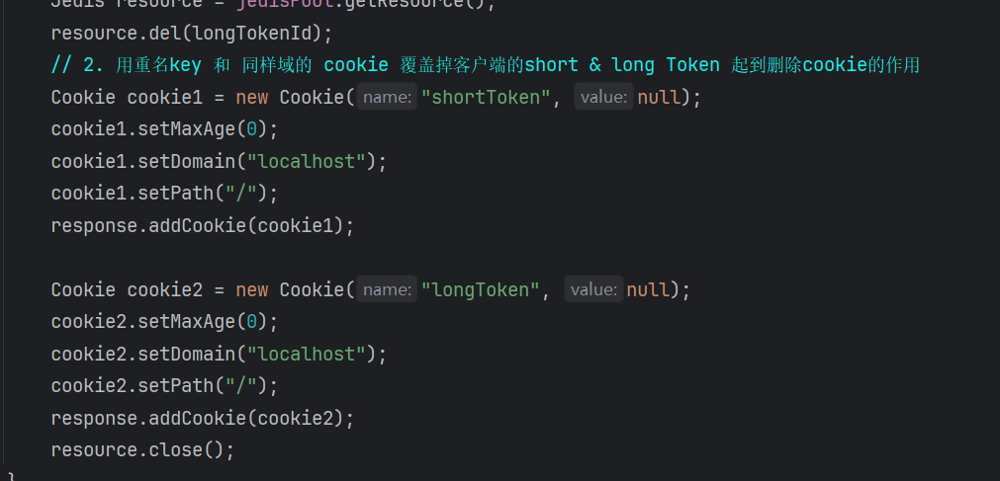
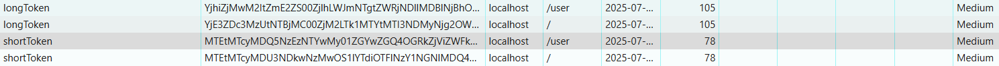
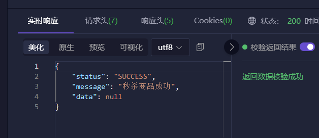
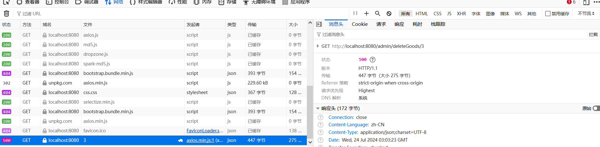
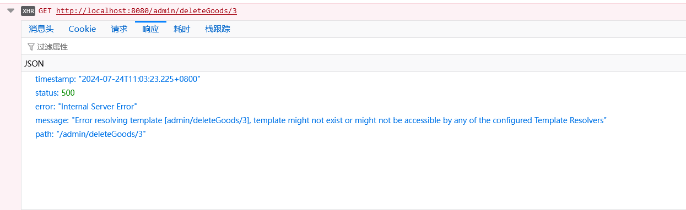
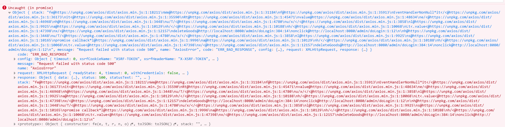
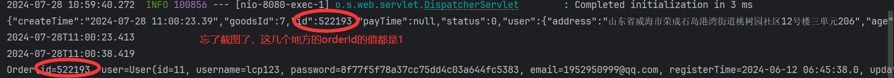
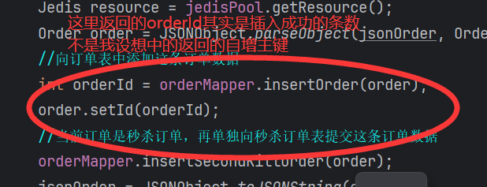
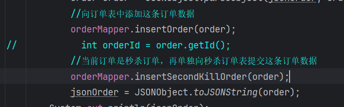

### 遇到的问题1
- 困扰了一个星期，使用 `@CookieValue` 注解拿不到Token，而且报错信息还
是没有叫shortToken和longToken的Cookie。

拿这个报错去网上搜，全是说key拼错了，跟浏览器上的cookie不匹配(比如JSESSIONID
和JsessionId)，一个一个字母对着也没发现有拼写错误，开始怀疑人生了。
- 一段时间后我发现我请求的一级路径是 `/goods` ，而我的token的路径是 `/user`，
我看到了希望，立马把cookie的路径设置为 `/`，在任何路径都能访问到。

重启项目并重新登陆以后，发现还是不行，再次失望。
- 每天早上都拿出来看看有没有什么新思路，要是一上午没有思路就去看面经，今天早上我
看浏览器cookie的时候突然发现， `shortToken和longToken各有两个`。

这两个token的区别也很明显，一个是全路径一个是/user下。最重要的是 `他俩的value不一样`。
- 我设置的cookie过期时长是一年，之前我虽然改了路径，但是原先的cookie并没有删除，
我感觉就有可能是这两个多出来的cookie导致我不能正常的运行，于是我把多余的两个cookie删掉了，
问题解决！

### 遇到的问题2
- 聚合报告出现 `HTTP请求,Non HTTP response code: java.net.SocketException,Non HTTP response message: Socket closed` 这种错误。
- 造成的原因是拿完redis连接后没有归还到连接池中。
- 在 return 之前加一个 `resource.close()` 解决。

### 遇到的问题3
- 管理员删除商品的功能，理想中应该是删除商品，然后根据后端返回的响应报文，在浏览器中弹框
- 但是现在虽然删除了商品，但是前端一点反应也没有，查看F12的网络，还报了个500
    
- 控制台报了一堆看不懂的
    
    
- 检查以后发现，在Controller层的方法少了一个 `@ResponseBody` 注解，加上以后，问题解决。
### 遇到的问题4
- 在延迟队列的消费者那里老是遇到空指针异常，顺藤摸瓜发现是当获取order对象时，当前的order对象为空。
- 为啥这个order对象会是空的， `currentOrder` 这个对象时根据 `orderId` 从数据库中获取的订单当前的状态，
    我打印了一下传入的order对象发现问题。
    
- 这个orderId明显不对，应该是五十多万，为啥全都是1，去网上发现确实有人跟我遇到相同的问题的。
- 因为我在原先返回的orderId不是orderId，而是插入成功的条数。我以为返回自增主键需要有参数接着，其实那个自增主键会自动的插入对象中
    
- 更改后空指针异常消失
    